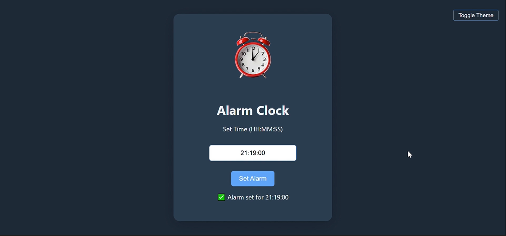

# ⏰ Interactive Alarm Clock – Python Flask Mini Project

A minimalist and fully functional **Alarm Clock** web app crafted with **Python** and **Flask**.  
It lets users set custom alarm times, triggers a continuous sound when the alarm hits and provides a seamless stop option — all within a toggleable light/dark UI.

## 🌟 Key Highlights

- 🎯 Set real-time alarms with ease  
- 🔔 Continuous audio alert until stopped  
- 🎚️ Single-click alarm stop feature  
- 🌗 Switch between Light and Dark mode  
- 💻 Responsive & sleek user interface  

## 🛠 Tech Stack

- **Frontend**: HTML, CSS, JavaScript  
- **Backend**: Python (Flask)  

## 📸 Live Preview

